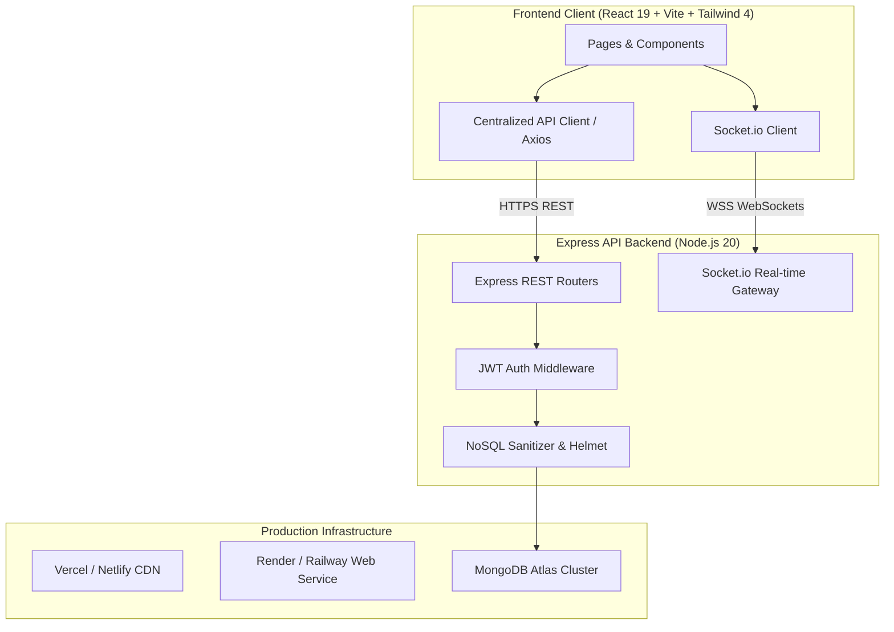

# 🌿 SwapStyle India — Sustainable Clothing Exchange & Barter Marketplace

<div align="center">

[](https://opensource.org/licenses/MIT)
[](https://nodejs.org)
[](https://react.dev)
[](https://vitejs.dev)
[](https://expressjs.com)
[](https://www.mongodb.com)
[](https://socket.io)
[](https://tailwindcss.com)
[](https://www.docker.com)

**A full-stack, circular fashion exchange marketplace empowering sustainable clothing swaps across India through an intelligent barter network, AI fashion assistant, real-time negotiation, and gamified eco-metrics.**

[Key Features](#-key-features) • [Architecture](#-architecture) • [Quickstart](#-quickstart-with-docker) • [Local Setup](#-manual-local-setup) • [Deployment Guide](#-production-deployment-guide) • [API Docs](#-api-endpoints)

</div>

---

## 📖 Overview

Fast fashion accounts for over 10% of global carbon emissions and millions of tons of landfill waste annually. **SwapStyle India** is built to pioneer a circular economy for apparel. Users can barter their pre-loved garments directly with other fashion enthusiasts without cash transactions, calculating real-time water and carbon savings for every garment kept in circulation.

---

## ✨ Key Features

- **🤖 AI Fashion Stylist & Circular Eco-Calculator**: Get instant style recommendations by vibe and occasion, plus automated water and CO₂e conservation calculations for swapped fabrics (Khadi, Banarasi Silk, Linen, etc.).
- **⚡ Smart Compatibility Matchmaker**: Proprietary algorithm calculates value parity, garment condition, sizing, and geographic proximity to suggest highest-compatibility swap matches.
- **💬 Real-time Negotiation & Chat**: Socket.io-powered instant messaging with dispute reporting and swap completion confirmation.
- **🗺️ Interactive Map & City Hubs**: Interactive OpenStreetMap visualization showcasing live listings across Indian metro and tier-1 hubs.
- **🏆 Gamification & Eco-Passports**: Earn Eco-Points for listing and swapping items; unlock badges ("Western Ghats Guardian", "Eco Warrior", "Khadi Pioneer") and climb national leaderboards.
- **🛡️ Admin Command Center**: Telemetry dashboard with user management, dispute moderation, and exchange analytics.
- **📱 PWA & Mobile-First Experience**: Progressive Web App capabilities with offline precaching and responsive animations powered by Framer Motion.

---

## 🏗️ Architecture



---

## 📂 Project Structure

```
Clothing-exchange/
├── .github/
│   ├── workflows/
│   │   └── ci.yml               # Automated CI pipeline for linting & build checks
│   ├── ISSUE_TEMPLATE/          # Issue reporting templates
│   └── PULL_REQUEST_TEMPLATE.md # Standard PR checklist
├── backend/
│   ├── controllers/             # Request controllers (auth, items, swaps, admin)
│   ├── middleware/              # JWT verification & Error handlers
│   ├── models/                  # Mongoose data schemas (User, Item, Swap, Chat)
│   ├── routes/                  # Express API route endpoints
│   ├── uploads/                 # Static upload destination (.gitkeep tracked)
│   ├── Dockerfile               # Production container definition for API
│   ├── .dockerignore
│   ├── .env.example             # Backend environment template
│   ├── package.json
│   └── server.js                # Server entry point & Socket.io setup
├── frontend/
│   ├── public/                  # Static assets and PWA icons
│   ├── src/
│   │   ├── components/          # Reusable UI components (NavBar, Modals, Maps)
│   │   ├── context/             # AuthContext state management
│   │   ├── pages/               # Application views (Marketplace, Chat, Dashboard)
│   │   ├── utils/
│   │   │   └── apiClient.js     # Unified dynamic API client & URL resolvers
│   │   ├── App.jsx              # Main router definition
│   │   └── main.jsx
│   ├── Dockerfile               # Multi-stage Nginx container definition
│   ├── nginx.conf               # SPA routing & caching rules
│   ├── .dockerignore
│   ├── .env.example             # Frontend environment template
│   ├── package.json
│   └── vite.config.js           # Vite & PWA bundler configuration
├── docker-compose.yml           # Full-stack container orchestration
├── CONTRIBUTING.md              # Community contribution guide
├── CODE_OF_CONDUCT.md
├── SECURITY.md                  # Security and vulnerability reporting policy
├── LICENSE                      # MIT Open Source License
└── README.md
```

---

## 🚀 Quickstart with Docker

The fastest way to run the complete stack (MongoDB + Backend + Frontend) locally:

### Prerequisites
- [Docker Desktop](https://www.docker.com/products/docker-desktop/) installed and running.

### One-Command Launch
```bash
# Clone the repository
git clone https://github.com/YOUR-USERNAME/Clothing-exchange.git
cd Clothing-exchange

# Start all services
docker compose up --build
```

- **Frontend**: Accessible at [http://localhost:3000](http://localhost:3000)
- **Backend API**: Accessible at [http://localhost:5000](http://localhost:5000)
- **MongoDB**: Accessible on port `27017`

---

## 💻 Manual Local Setup

### 1. Prerequisites
- **Node.js**: v18.0.0 or higher ([Download Node.js](https://nodejs.org))
- **MongoDB**: Local MongoDB instance running or a free [MongoDB Atlas](https://www.mongodb.com/cloud/atlas) connection URI.

### 2. Installation
Install all root, backend, and frontend dependencies in one step:
```bash
npm run install-all
```

### 3. Environment Configuration

#### Backend (`backend/.env`)
Create `backend/.env` from template:
```bash
cp backend/.env.example backend/.env
```
Ensure the variables match your setup:
```env
PORT=5000
NODE_ENV=development
MONGODB_URI=mongodb://localhost:27017/clothing-swap
JWT_SECRET=your_super_secret_jwt_key
CLIENT_URL=http://localhost:5173,http://localhost:3000
```

#### Frontend (`frontend/.env`)
Create `frontend/.env` from template:
```bash
cp frontend/.env.example frontend/.env
```
Configure:
```env
VITE_API_URL=http://localhost:5000
```

### 4. Run Development Servers
```bash
npm run dev
```
- Frontend starts on: `http://localhost:5173`
- Backend API starts on: `http://localhost:5000`

---

## 🌐 Production Deployment Guide

### 1. Database (MongoDB Atlas)
1. Create a free cluster on [MongoDB Atlas](https://www.mongodb.com/cloud/atlas).
2. In **Network Access**, allow access from anywhere (`0.0.0.0/0`) or your server IPs.
3. In **Database Access**, create a user and copy the connection string (`mongodb+srv://...`).

---

### 2. Backend Deployment (Render / Railway)

#### Deploying on Render:
1. Create a new **Web Service** on [Render](https://render.com).
2. Connect your GitHub repository.
3. Set **Root Directory** to `backend`.
4. Set **Runtime** to `Node`.
5. Set **Build Command** to `npm install`.
6. Set **Start Command** to `npm start`.
7. Configure Environment Variables in the Render dashboard:
   | Key | Value |
   | --- | --- |
   | `NODE_ENV` | `production` |
   | `PORT` | `5000` (or leave default for Render) |
   | `MONGODB_URI` | *Your MongoDB Atlas connection URI* |
   | `JWT_SECRET` | *A secure random 64-character secret* |
   | `CLIENT_URL` | *Your deployed frontend URL (e.g. `https://your-app.vercel.app`)* |

---

### 3. Frontend Deployment (Vercel / Netlify)

#### Deploying on Vercel:
1. Create a new project on [Vercel](https://vercel.com) and import the repository.
2. Set **Root Directory** to `frontend`.
3. Framework Preset: **Vite**.
4. Configure Environment Variables in Vercel:
   | Key | Value |
   | --- | --- |
   | `VITE_API_URL` | *Your deployed Render backend URL (e.g. `https://your-api.onrender.com`)* |
5. Click **Deploy**.

---

## 📡 API Endpoints

### Authentication (`/api/auth`)
| Method | Endpoint | Description | Auth Required |
| :--- | :--- | :--- | :---: |
| `POST` | `/api/auth/register` | Register new user account (awards +30 Eco-Points) | No |
| `POST` | `/api/auth/login` | User login and JWT issuance | No |
| `GET` | `/api/auth/profile` | Retrieve authenticated user profile & stats | Yes |
| `PUT` | `/api/auth/profile` | Update profile information & avatar | Yes |
| `POST` | `/api/auth/wishlist/:id` | Add or remove item from user's wishlist | Yes |

### Garment Listings (`/api/items`)
| Method | Endpoint | Description | Auth Required |
| :--- | :--- | :--- | :---: |
| `GET` | `/api/items` | Query listings with search, category, location filters & pagination | No |
| `GET` | `/api/items/:id` | Get specific listing details with owner information | No |
| `POST` | `/api/items` | Create a new garment listing | Yes |
| `PUT` | `/api/items/:id` | Update an existing listing | Yes |
| `DELETE` | `/api/items/:id` | Delete a garment listing | Yes |
| `POST` | `/api/items/calculate-value` | Calculate suggested value tier based on brand/condition | Yes |
| `POST` | `/api/items/:id/boost` | Boost listing to featured tier | Yes |

### Swap Negotiations (`/api/swaps`)
| Method | Endpoint | Description | Auth Required |
| :--- | :--- | :--- | :---: |
| `GET` | `/api/swaps/incoming` | Get incoming swap requests for user's items | Yes |
| `GET` | `/api/swaps/outgoing` | Get swap requests sent by the user | Yes |
| `POST` | `/api/swaps` | Propose a new item-for-item swap | Yes |
| `PATCH`| `/api/swaps/:id/status` | Accept, reject, or complete swap | Yes |
| `POST` | `/api/swaps/:id/dispute`| Report a dispute for administrative review | Yes |

### AI Studio & Sustainability (`/api/ai`)
| Method | Endpoint | Description | Auth Required |
| :--- | :--- | :--- | :---: |
| `POST` | `/api/ai/stylist` | Generate personalized outfit suggestions | No |
| `POST` | `/api/ai/sustainability-score` | Calculate liters of water & kg of CO₂ saved | No |
| `POST` | `/api/ai/analyze` | Magic auto-fill listing details from image & category | Yes |

### Real-Time Chat & System (`/api/chat`, `/api/health`)
| Method | Endpoint | Description | Auth Required |
| :--- | :--- | :--- | :---: |
| `GET` | `/api/chat/:swapRequestId` | Retrieve chat history for swap negotiation | Yes |
| `POST` | `/api/chat/:swapRequestId` | Send chat message within room | Yes |
| `GET` | `/api/health` | Service health status & database connectivity | No |

---

## 🛡️ Security Best Practices

- **Token Protection**: JWTs validated on every authenticated API route.
- **Injection Protection**: `express-mongo-sanitize` strips operator characters (`$`, `.`) from request bodies.
- **Header Hardening**: `helmet` sets secure HTTP response headers.
- **Rate Limiting**: `express-rate-limit` prevents brute force and DDoS on public API routes.
- **File Upload Safety**: Multer validated for supported MIME types and 5MB payload caps.

---

## 🤝 Contributing

Contributions are warmly welcomed! Please read [CONTRIBUTING.md](CONTRIBUTING.md) and [CODE_OF_CONDUCT.md](CODE_OF_CONDUCT.md) for details on our code of conduct and development workflow.

---

## 📄 License

This project is open source and available under the [MIT License](LICENSE).
